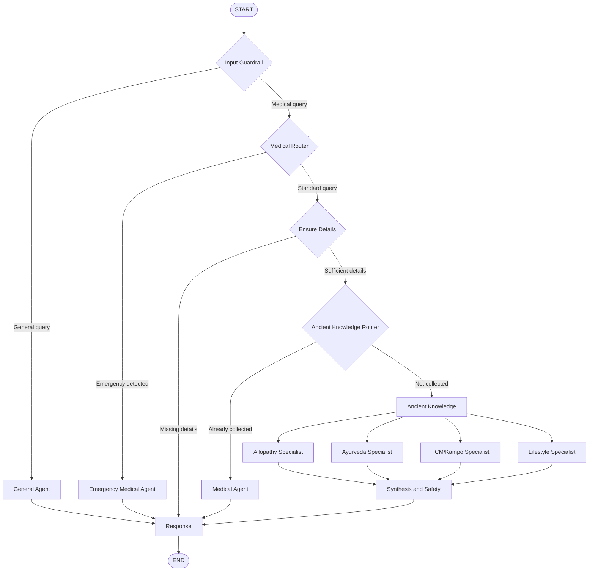

# Personalized Medical Assistant

## Overview

The **Personalized Medical Assistant** is an advanced AI system that delivers comprehensive, tailored health guidance by bridging modern Western medicine (Allopathy) with traditional healing systems (Ayurveda, TCM/Kampo) and lifestyle recommendations.

It ensures **safety and relevance** through input guardrails, contraindication checks, and a persistent user health profile, preventing adverse interactions between treatments. Powered by **LangGraph**, it orchestrates parallel specialist agents to generate **accurate, personalized, and safe responses**.

## Getting Started

### Prerequisites

- Python 3.13 or higher
- [uv](https://github.com/astral-sh/uv) package manager
- docker and docker-compose

### Installation

1. Clone the repository:

   ```bash
   git clone <repository-url>
   cd personal-medical-assistant
   ```

2. Install dependencies using `uv`:

   ```bash
   uv sync
   ```

3. Set up environment variables:
   Create a `.env` file in the `app` directory with necessary API keys (OpenAI, Groq, Database URL, etc.).

### Running the Application

To start the FastAPI server locally:
In terminal 1

```bash
cd app
docker-compose up
```

API will be available at `http://localhost:8080`.

In terminal 2

```bash
uv run streamlit run scripts/chatbot.py
```

The UI will be available at `http://localhost:8501`.

## Orchestration



## Tech Stack

- **Framework**: FastAPI
- **Orchestration**: LangGraph, LangChain
- **Database**: PostgreSQL (with `asyncpg` and `langgraph-checkpoint-postgres`)
- **Runtime**: Python 3.13+
- **Package Manager**: uv