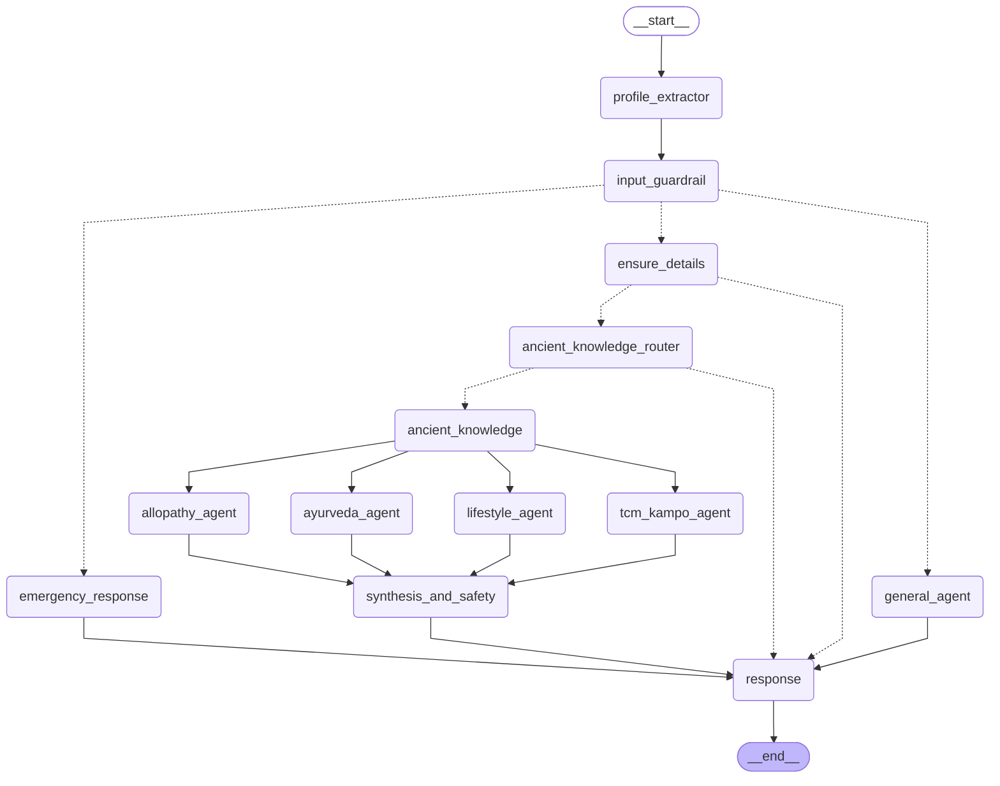

```mermaid
---
config:
  flowchart:
    curve: linear
---
graph TD;
	__start__([<p>__start__</p>]):::first
	profile_extractor(profile_extractor)
	input_guardrail(input_guardrail)
	response(response)
	general_agent(general_agent)
	ensure_details(ensure_details)
	ancient_knowledge_router(ancient_knowledge_router)
	ancient_knowledge(ancient_knowledge)
	allopathy_agent(allopathy_agent)
	emergency_response(emergency_response)
	tcm_kampo_agent(tcm_kampo_agent)
	ayurveda_agent(ayurveda_agent)
	lifestyle_agent(lifestyle_agent)
	synthesis_and_safety(synthesis_and_safety)
	__end__([<p>__end__</p>]):::last
	__start__ --> profile_extractor;
	allopathy_agent --> synthesis_and_safety;
	ancient_knowledge --> allopathy_agent;
	ancient_knowledge --> ayurveda_agent;
	ancient_knowledge --> lifestyle_agent;
	ancient_knowledge --> tcm_kampo_agent;
	ancient_knowledge_router -.-> ancient_knowledge;
	ancient_knowledge_router -.-> response;
	ayurveda_agent --> synthesis_and_safety;
	emergency_response --> response;
	ensure_details -.-> ancient_knowledge_router;
	ensure_details -.-> response;
	general_agent --> response;
	input_guardrail -.-> emergency_response;
	input_guardrail -.-> ensure_details;
	input_guardrail -.-> general_agent;
	lifestyle_agent --> synthesis_and_safety;
	profile_extractor --> input_guardrail;
	synthesis_and_safety --> response;
	tcm_kampo_agent --> synthesis_and_safety;
	response --> __end__;
	classDef default fill:#f2f0ff,line-height:1.2
	classDef first fill-opacity:0
	classDef last fill:#bfb6fc

```