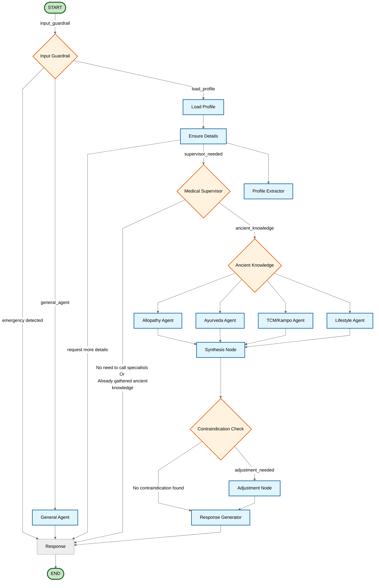

# LangGraph Orchestration Flow - Mermaid Diagram

## Orchestration Graph

## Flow Description

### Phase 1: Input and Safety

- **START** → `input_guardrail`: Analyzes input for safety and appropriateness.
  - **Unsafe/Inappropriate** → `response` → **END**: Direct response for filtered content.
  - **General Query** → `general_agent` → `response` → **END**: Handles non-medical, casual conversation.
  - **Medical Query** → `load_profile`: Proceeds to load user context.

### Phase 2: Profile Loading and Detail Verification

- `load_profile`: Retrieves user profile and conversation history.
- `load_profile` → `ensure_details`: Validates if sufficient information exists to answer the medical query.
  - **Missing Critical Data** → `response` → **END**: Requests clarification from the user.
  - **Data Sufficient** → `medical_supervisor`: Proceeds to medical orchestration.

### Phase 3: Medical Supervisor

- `medical_supervisor`: Orchestrates the medical consultation flow and determines the approach.
  - **Direct Response Needed** → `response` → **END**: Provides immediate response for simple queries.
  - **Comprehensive Analysis Required** → `ancient_knowledge`: Triggers specialist agents.

### Phase 4: Specialist Agents (Parallel Execution)

- `ancient_knowledge`: Coordinates parallel execution of specialist agents to gather diverse medical perspectives:
  - `allopathy_agent`: Conventional medicine and evidence-based guidelines (uses PubMed RAG).
  - `tcm_kampo_agent`: Traditional Chinese Medicine and Kampo herbal medicine (uses Kampo DB).
  - `ayurveda_agent`: Ayurvedic principles and holistic remedies.
  - `lifestyle_agent`: Nutrition and lifestyle recommendations (uses Nutrition API).
- All specialist agents converge at `synthesis_node`.

### Phase 5: Synthesis and Safety Validation

- `synthesis_node`: Aggregates insights from all specialist agents into a cohesive draft response.
- `synthesis_node` → `contraindication_check`: "Salt-Ramen" Safety Layer - validates interactions between recommendations (e.g., Western medications vs. herbal supplements, dietary restrictions).
  - **Risk Detected** → `adjustment_node` → `response_generator`: Refines recommendations to eliminate safety risks.
  - **Safe** → `response_generator`: Proceeds directly to response generation.

### Phase 6: Response Generation and Memory Update

- `response_generator`: Formats the final comprehensive response for the user.
- `response_generator` → `profile_extractor`: Extracts and updates user profile with new health data or preferences learned during the session.
- `profile_extractor` → `response`: Prepares final response.
- `response` → **END**: Delivers response to user.

### Nodes

| Node | Type | Description |
|------|------|-------------|
| `input_guardrail` | Safety | Filters unsafe content and routes based on query type. |
| `general_agent` | Agent | Handles casual/general non-medical queries. |
| `load_profile` | Memory | Retrieves user history and health profile. |
| `ensure_details` | Decision | Validates if sufficient information exists to proceed with medical consultation. |
| `medical_supervisor` | Orchestrator | Decides if direct response is needed or if specialist agents should run. |
| `ancient_knowledge` | Orchestrator | Coordinates parallel execution of specialist medical agents. |
| `allopathy_agent` | Specialist | Western medicine expert with evidence-based guidelines. |
| `tcm_kampo_agent` | Specialist | Traditional Chinese Medicine and Kampo herbal medicine expert. |
| `ayurveda_agent` | Specialist | Ayurvedic medicine and holistic health expert. |
| `lifestyle_agent` | Specialist | Lifestyle, nutrition, and wellness expert. |
| `synthesis_node` | Logic | Combines specialist outputs into a cohesive draft response. |
| `contraindication_check` | Safety | Validates drug-herb-food interactions and safety conflicts. |
| `adjustment_node` | Logic | Modifies response to resolve safety conflicts identified by contraindication check. |
| `response_generator` | Output | Formats final comprehensive response for the user. |
| `profile_extractor` | Memory | Extracts and updates persistent user profile with new health data. |
| `response` | Output | Final response node that delivers output to the user. |
