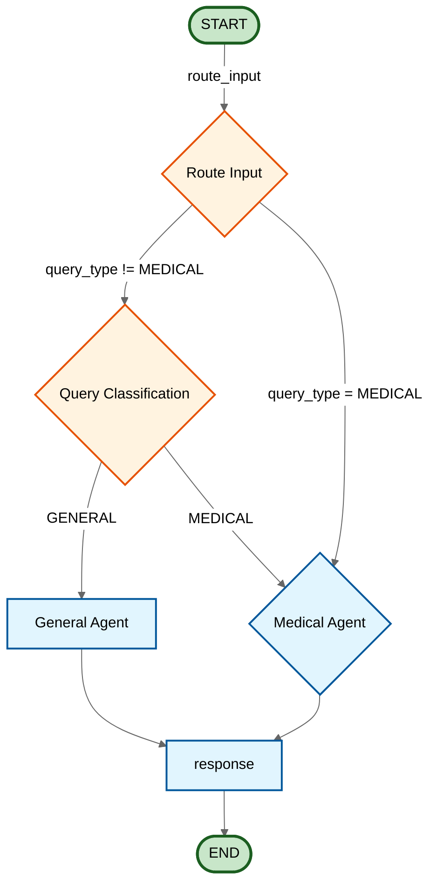

# LangGraph Orchestration Flow - Mermaid Diagram

## Orchestration Graph

## Flow Description

### Entry Point
- **START** → `route_input` (Route Input decision)

### Main Routing Paths

#### 1. Route Input (`route_input`)
Determines initial routing based on query type and state:
- **query_type != "MEDICAL"** → Go to `query_classification`
- **query_type = "MEDICAL"** → Go to `medical_agent`

#### 2. Query Classification (`route_classification`)
Classifies the user query:
- **query_type = "GENERAL"** → Go to `general_agent`
- **query_type = "MEDICAL"** → Go to `medical_agent`

#### 3. General Agent
Handles general queries:
- → `response` → END

#### 4. Medical Agent
Handles medical queries:
- → `response` → END

### Nodes

| Node | Description |
|------|-------------|
| `route_input` | Routes based on query type and session state |
| `query_classification` | Classifies query as GENERAL or MEDICAL |
| `general_agent` | Handles general queries |
| `medical_agent` | Handles medical queries |
| `response` | Sends response to user |
