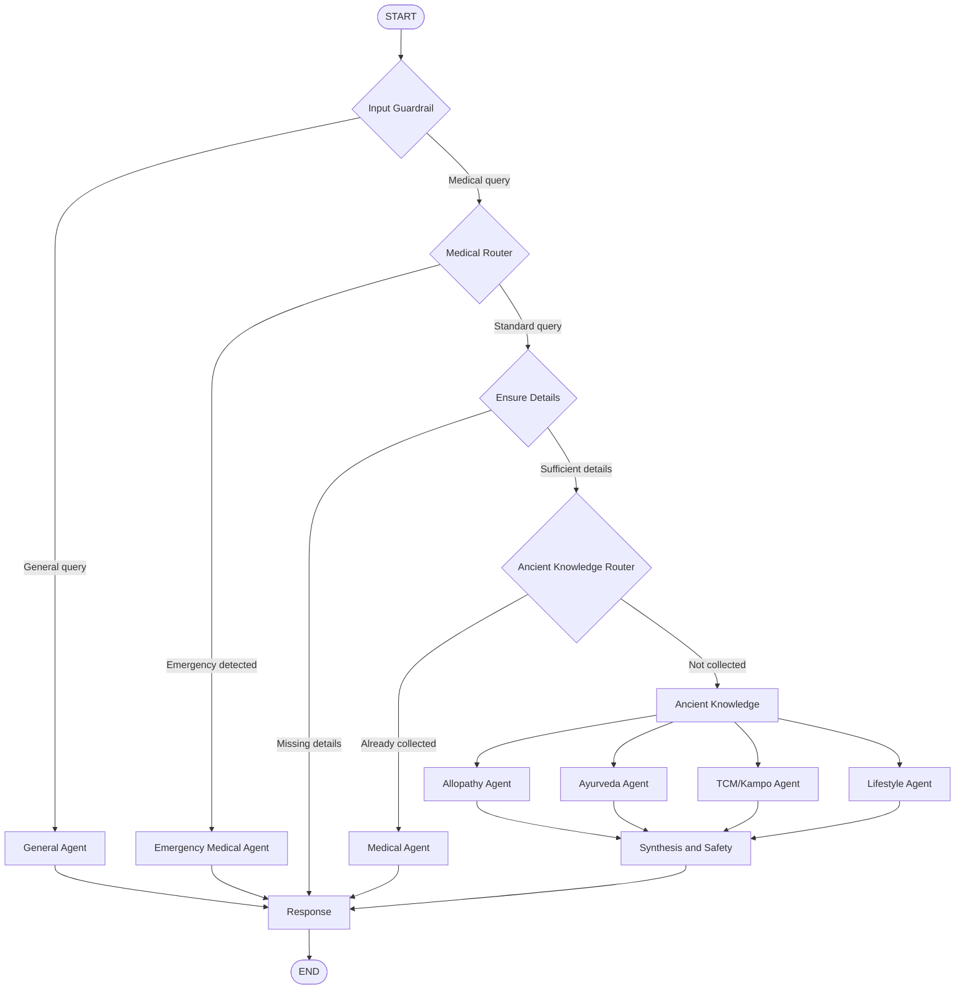

# LangGraph Orchestration Flow

## Orchestration Graph

```mermaid
graph TD
    START([START]) --> input_guardrail{Input Guardrail}

    %% Input routing
    input_guardrail -->|General query| general_agent[General Agent]
    input_guardrail -->|Medical query| medical_router{Medical Router}

    %% Medical routing
    medical_router -->|Emergency detected| emergency_medical_agent[Emergency Medical Agent]
    medical_router -->|Standard query| ensure_details{Ensure Details}

    %% General Agent
    general_agent --> response[Response]

    %% Details verification
    ensure_details -->|Missing details| response
    ensure_details -->|Sufficient details| ancient_knowledge_router{Ancient Knowledge Router}

    %% Ancient knowledge routing
    ancient_knowledge_router -->|Already collected| medical_agent[Medical Agent]
    ancient_knowledge_router -->|Not collected| ancient_knowledge[Ancient Knowledge]

    %% Specialist agents - parallel execution
    ancient_knowledge --> allopathy_agent[Allopathy Agent]
    ancient_knowledge --> ayurveda_agent[Ayurveda Agent]
    ancient_knowledge --> tcm_kampo_agent[TCM/Kampo Agent]
    ancient_knowledge --> lifestyle_agent[Lifestyle Agent]

    %% Synthesis
    allopathy_agent --> synthesis_and_safety[Synthesis and Safety]
    ayurveda_agent --> synthesis_and_safety
    tcm_kampo_agent --> synthesis_and_safety
    lifestyle_agent --> synthesis_and_safety

    %% Final responses
    emergency_medical_agent --> response
    medical_agent --> response
    synthesis_and_safety --> response

    %% End
    response --> END([END])
```

## Flow Description

### Phase 1: Input Guardrail

- **START** → `input_guardrail`: Analyzes input for safety and classifies query type.
  - Sets `is_medical` and `is_emergency` flags in state.
  - **General Query** → `general_agent` → `response` → **END**: Handles non-medical conversation.
  - **Medical Query** → `medical_router`: Proceeds to medical routing.

### Phase 2: Medical Routing

- `medical_router`: Routes based on emergency status (pass-through node, routing handled by conditional edges).
  - **Emergency Detected** (`is_emergency=True`) → `emergency_medical_agent` → `response` → **END**: Immediate emergency guidance.
  - **Standard Query** → `ensure_details`: Proceeds to detail verification.

### Phase 3: Ensure Details

- `ensure_details`: Validates if sufficient information exists to answer the medical query.
  - Sets `has_sufficient_details` and `requested_details` in state.
  - **Missing Critical Data** → `response` → **END**: Requests clarification from the user.
  - **Data Sufficient** → `ancient_knowledge_router`: Proceeds to knowledge collection routing.

### Phase 4: Ancient Knowledge Collection

- `ancient_knowledge_router`: Routes based on whether ancient knowledge has been collected (pass-through node).
  - **Already Collected** (`gathered_ancient_knowledge=True`) → `medical_agent` → `response` → **END**: Direct medical response for follow-up queries.
  - **Not Collected** → `ancient_knowledge`: Triggers parallel specialist execution.

- `ancient_knowledge`: Coordinates parallel execution of specialist agents:
  - `allopathy_agent`: Western medicine and evidence-based guidelines.
  - `ayurveda_agent`: Ayurvedic principles and holistic remedies.
  - `tcm_kampo_agent`: Traditional Chinese Medicine and Kampo herbal medicine.
  - `lifestyle_agent`: Nutrition and lifestyle recommendations.

- Each specialist stores its response in state (`allopathy_response`, `ayurveda_response`, `tcm_response`, `lifestyle_response`).

### Phase 5: Synthesis and Safety

- `synthesis_and_safety`: Aggregates insights from all specialist agents into a cohesive response.
  - Combines specialist outputs.
  - Validates drug-herb-food interactions and safety conflicts.
  - Generates final comprehensive response.

### Phase 6: Response

- `response`: Final output node that returns `state.response` to the user.
- `response` → **END**: Delivers response to user.

## Nodes

| Node                       | Type         | Description                                                    |
|----------------------------|--------------|----------------------------------------------------------------|
| `input_guardrail`          | Safety       | Filters unsafe content, classifies medical vs general queries. |
| `general_agent`            | Agent        | Handles non-medical, casual conversation.                      |
| `medical_router`           | Router       | Pass-through node; routing handled by conditional edges.       |
| `emergency_medical_agent`  | Agent        | Handles emergency medical queries with immediate guidance.     |
| `ensure_details`           | Decision     | Validates if sufficient information exists to proceed.         |
| `ancient_knowledge_router` | Router       | Routes based on ancient knowledge collection status.           |
| `ancient_knowledge`        | Orchestrator | Triggers parallel execution of specialist agents.              |
| `allopathy_agent`          | Specialist   | Western medicine expert with evidence-based guidelines.        |
| `ayurveda_agent`           | Specialist   | Ayurvedic medicine and holistic health expert.                 |
| `tcm_kampo_agent`          | Specialist   | Traditional Chinese Medicine and Kampo expert.                 |
| `lifestyle_agent`          | Specialist   | Lifestyle, nutrition, and wellness expert.                     |
| `medical_agent`            | Agent        | Handles standard medical queries after specialists have run.   |
| `synthesis_and_safety`     | Logic        | Combines specialist outputs and validates safety.              |
| `response`                 | Output       | Final response node that delivers output to the user.          |

## State Fields

| Field                        | Type          | Description                                     |
|------------------------------|---------------|-------------------------------------------------|
| `session_id`                 | `str`         | Session identifier.                             |
| `user_id`                    | `str`         | User identifier.                                |
| `user_input`                 | `str`         | Current user input.                             |
| `is_emergency`               | `bool`        | Emergency flag set by input guardrail.          |
| `is_medical`                 | `bool`        | Medical query flag set by input guardrail.      |
| `has_sufficient_details`     | `bool`        | Details sufficiency flag set by ensure_details. |
| `requested_details`          | `str`         | Details request message when insufficient.      |
| `gathered_ancient_knowledge` | `bool`        | Ancient knowledge collection status.            |
| `allopathy_response`         | `str`         | Allopathy specialist response.                  |
| `ayurveda_response`          | `str`         | Ayurveda specialist response.                   |
| `tcm_response`               | `str`         | TCM/Kampo specialist response.                  |
| `lifestyle_response`         | `str`         | Lifestyle specialist response.                  |
| `safety_warnings`            | `list[str]`   | Safety warnings from synthesis.                 |
| `response`                   | `str`         | Final response to user.                         |
| `conversation_history`       | `list[dict]`  | Conversation context.                           |
| `user_profile`               | `UserProfile` | User profile data.                              |

## Source Files

- `app/agent/graph_builder.py` - Graph structure definition.
- `app/agent/graph_nodes.py` - Node implementations.
- `app/agent/graph_edges.py` - Conditional routing logic.
- `app/config/state.py` - SessionState model.
